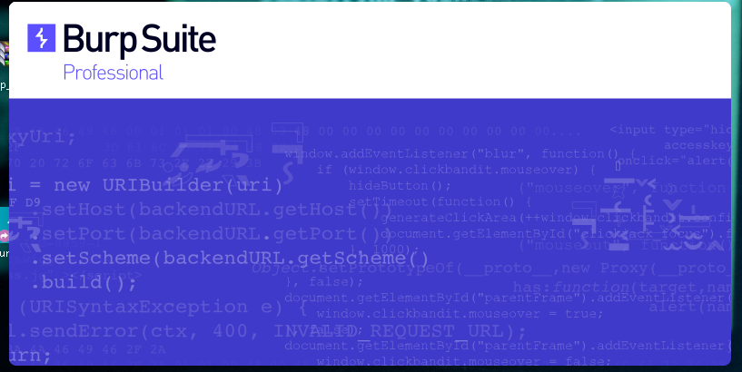

# BurpSuite Pro Windows 10 et Kali Linux (toute plateforme)

 

## Instruction installation

    1- Télécharger l'archive 'https://casagency.fr/burpsuite/Burp_Suite.rar'
    2- Décompresser et copier Tout le dossier '"Burp_Suite"' et son contenu dans '"C:\Program Files (x86)\"'

### Lancé un powershell (en administrateur) et effectuer cette commande
    java --illegal-access=permit -javaagent:"C:\Program Files (x86)\Burp_Suite\loader.jar" -noverify -jar "C:\Program Files (x86)\Burp_Suite\burpsuite_pro_v2021.10.3.jar"

Ou copier le fichier 'burpsuite.Lnk' sur votre bureau cela devrait lancer Burpsuite directement sans taper la commande

Si cela vous demande une licence lancer exécution du 'keygen.jar'
